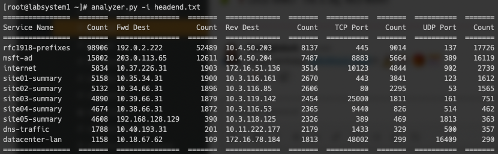

# analyzer.py – Session Analysis for 128T 

The `analyzer.py` script was designed to programmatically parse through the mountain of data provided by a 128T router's *session table* (which tracks all active connections through the system) to look for:

- Aberrant numbers of sessions of a given type
- Which services are getting exercised, by whom, and to what destination(s)
- Which "applications" (port and protocol tuples) are most common

It is a useful tool for taking the data from a running system, and using it to find areas of optimization for a running configuration.

## Installing

1. Copy the script into `/usr/local/bin` of your 128T Conductor, or anywhere else present in your `$PATH` environment variable. (While the script has usable modes on any operating system with python installed, the primary means of retrieving the session table is using GraphQL, which requires it to be installed directly on a Conductor node.)

2. Set the permissions: `chmod 755 analyzer.py`, and `chown root:root analyzer.py`.
3. Install the `tabulate` package using *pip* as root user: `pip install tabulate`. (The `tabulate` package is used for displaying the tabular output.)

Test your installation by running the script:

```
[t128@labsystem1 ~]$ sudo analyzer.py --help
```

If your installation is successful, you will see the output of the command syntax for `analyzer`.

### Installation on macOS

I haven't done extensive testing on macOS; I run macOS Mojave (which includes python 2.7.16). In order to get the script to run (in offline mode only), you'll need to install the `requests` module in addition to `tabulate`. As an administrative user (i.e., your login account), type `sudo pip install requests tabulate` from a terminal shell.

## Running the Script

The script has two main modes of operation: *online mode* and *offline mode*.

### Online Mode

Online mode, which requires the script to be run directly on a 128T Conductor node, will use GraphQL to  retrieve the session table from the specified router (and optionally, a node within that router). To run `analyzer` in online mode, you must specify a router using `-r` or `--router=`:

```
[root@labsystem1 ~]# analyzer.py -r newton
```

Filtering to a specific node within that router is done using the optional `-n`/`--node=` argument:

```
[root@labsystem1 ~]# analyzer.py -r newton -n labsystem2
```

**Tip**: when running the script on a heavily loaded system, strongly consider using the `-o`/`--output=` flag described below. This will save the session table as a local filesystem, allowing you to re-run the script over the same contents again in offline mode; this saves a lot of wear and tear on the target router, so it doesn't have to repeatedly cough up a huge session table over and over during iterative analysis.

### Offline Mode

The script's offline mode will take a file as input; the file is expected to be in one of two formats: the format provided by the PCLI's `show sessions` command, or the format generated by the script itself when using the `-o` argument.

```
[root@labsystem1 ~]# analyzer.py -i foo.txt
```

**Suggestion**: rather than running `show sessions` and copying/pasting the contents to a file, use redirection; e.g., `show sessions router foo > /tmp/foo-20200926.txt`.

**Important**: as anyone who has worked with the PCLI's `show sessions` command before knows, the output will be wrapped awkwardly when you run the command on screens with narrow column widths. Therefore it is imperative that you *make the screen as wide as possible, and/or shrink your terminal font down* when generating the output. In happy news, this has been addressed as of 5.0 – no more awkward breaks in the middle of IP addresses.

## Command Line Options

There are a bunch of command line options for filtering the dataset returned by `analyze`, to let you hone in on a specific area of interest. In general, the options come in two forms: "filter only" and "filter out," where the "filter only" options take a lowercase (short form) argument, and the "filter out" options take an uppercase argument.

| Argument             | Usage                                                       |
| -------------------- | ------------------------------------------------------------ |
| `-a` or `--address=` | Filters the output to include only sessions/flows that match any of the addresses supplied. The input is provided as a comma-separated list; e.g.,<br />`-a 192.168.1.200,192.168.1.201,192.168.1.203` |
| `-A` or `--exclude-address=` | Filters the output to exclude any session data with any of the supplied addresses. The input is supplied as a comma-separated list as with `-a`. |
| `-s` or `--service=` | Filters the output to include only sessions/flows that match for the service name(s) supplied. To specify more than one service name at a time, use a comma-separated list; e.g.,<br />`-s internet,_conductor_1,dns-catcher` |
| `-S` or `--exclude-service` | Filters the output to exclude any session data with the supplied service name(s). Multiple services can be supplied as a comma-separated list as with `-s`. |
| `-x` or `--prefix=` | Filters the output to include only sessions/flows that contain an address within the specified prefix(es). To specify more than one prefix at a time, use a comma-separated list; e.g.,<br />`-x 192.168.0.0/16,10.0.0.0/8` |
| `-X` or `--exclude-prefix=` | Filters the output to exclude any session data containing addresses within the supplied prefix(es). Multiple prefixes can be supplied as a comma-separated list as with `-S`. |
| `-p` or `--port=` | Filters the output to include only rows that match the specified port(s). Multiple ports can be provided using a comma-separated list. |
| `-t` or `--top=` | The `analyze` script will show the top ten results from each category by default. You can change this (higher or lower) by specifying the value using `-t`; e.g.,<br />`-t 50` will show the top 50 highest counts for each category. |
| `-r` or `--router=` | Runs the script in *online mode*. This indicates the router from which the script should request the session table. |
| `-n` or `--node=` | When running the script in online mode, this allows you to filter the session table to one node of a multinode router. |
| `-i` or `--input=` | Runs the script in *offline mode*. This will read the contents of the local file you specify as the argument. |
| `-o` or `--output=` | Writes a local file with the contents of the session table. Useful when working in online mode, to store a copy of the session table to be re-analyzed using offline mode. This allows for iterative analysis of the data without repeatedly requesting the session table from a busy system. |
| `-g` or `--graph` | Displays a histogram of the expiry timers for all flows that are part of the output. Useful for identifying traffic patterns to tune `session-type` timers. |
| `-b` or `--bins` | When using the histogram output, the default is to group the flows into ten bins; this lets you override that value. |
| `-h` or `--help` | Prints the command syntax to the screen and exits. |
| `-v` or `--version` | Prints the current version and exits. |

## Interpreting the Output

Below is the sample output against a fictional head end router, in order to discuss how to interpret the output. (Note: familiarity with the topology and the service configuration is very helpful here, but not mandatory.)



There are fourteen columns of output: seven different categories, and their associated counts. By default, the `analyze` script will show the top ten counts for each category. The table is not read left-to-right, it is read top-to-bottom in column pairs; each column pair stands alone.

The **Service Name** column tabulates the popularity of the various services in the session table. In this sample output we see the vast majority of the sessions are built using the `dc-default` service.

The **Fwd Src** and **Fwd Dest** columns tabulates the most common IP addresses present in the **Source IP** and **Dest IP** columns of *forward flows* from the session table. For sessions that are "inbound" from this router's point of view – that is, sessions that originated at a remote 128T and are arriving on this router using SVR – this will usually be the *waypoint address(es)* of the two routers. An example of this in the table above is the `rfc1918-prefixes` service; this is used by remote sites to target resources within the data center. So all of these sessions were created by branch locations and sent to the head end over SVR. For sessions that are "outbound" from this router's point of view, it will be the actual destination addresses at the remote sites. An example of this from the table above are the `siteXX-summary` services, where clients on the head end's LAN are targeting the remote sites over SVR.

The **Rev Src** and **Rev Dest** column tabulates the most common IP addresses present in the **Src IP** and **Dest IP** columns of *reverse flows* from the session table. For inbound sessions these will be the targets on the "LAN" of the router. For outbound sessions these will be the actual address at the remote location.

The **TCP Port** and **UDP Port** columns tabulate the most common TCP and UDP port numbers found in the table. These can be matched against well-known port lists (e.g., the contents of `/etc/services` on any Linux host, or online databases such as [SANS Internet Storm Center](https://isc.sans.edu/port.html)). Note that the table will invariably include waypoint ports; these are typically in the range of 16385-65535 and should be fairly readily identifiable.

## Disclaimer

This is my own personal project, unaffiliated with 128 Technology and not supported by its Technical Support team. I will provide best effort support, I will take contributions, and I will take suggestions directly.

It has been tested against a variety of 128T Conductors with different software versions and active load, and has not been seen to cause any harmful side effects. When run in its native "GraphQL mode" it will retrieve the session table from the specified router; for head end systems (particularly those with tens of thousands of active sessions) this represents **a lot of data**. The script retrieves the session table in batches of 50 sessions/100 flows at a time – exactly the same sequencing that the PCLI and GUI both use – so the  technique is time tested and mother approved. However, *you run this at your own risk*.
