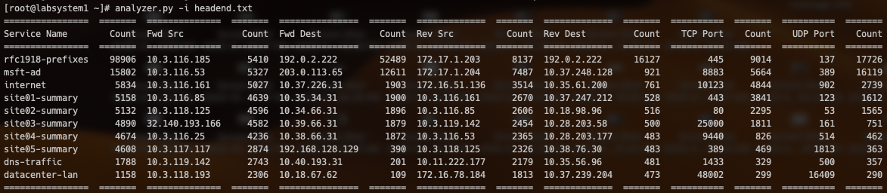
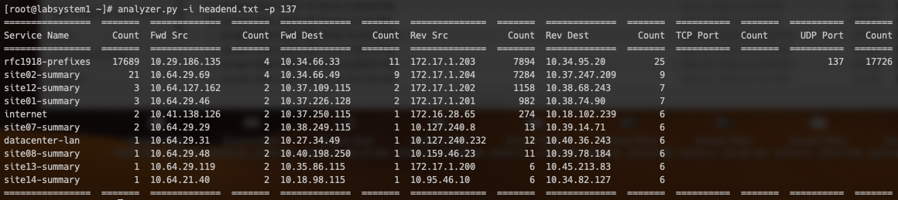

# Analyzing 128T Traffic using analyzer.py

The `analyzer.py` tool was designed to help administrators quickly parse through the mountains of data supplied by a 128T Session Smart router, to identify patterns of usage. The information it provides is invaluable for several key workflows:

- Identifying unknown/unexpected network traffic. The `analyzer.py` tool can bring "hidden traffic" to the forefront, for scrutiny by network administrators, security analysts, etc.
- Understanding the composition of the traffic on a network, for the purposes of subsequent service definition, traffic shaping, routing policies, etc.
- Enumerating the various application protocols in use on the network, which can be used to fine-tune `session-type` timer values, to optimize performance

This document walks through applying the `analyzer.py` tool, with several illustrative use cases.

## Basic Operation

All good analysis operations begin by simply invoking `analyzer.py` without any command line options to filter the output. As discussed in the README file, this is either done in *online mode* or *offline mode*.

Online mode:

```
[root@labsystem1 ~]# analyzer.py -r newton
```

Offline mode:

```
[root@labsystem1 ~]# analyzer.py -i newton.txt
```

This will produce tabular data that shows "top ten lists" for the most popular services, destinations (forward and reverse), TCP protocols, and UDP protocols.

> Regarding *forward* and *reverse* destinations: sessions processed by a 128T device will consist of forward flows and reverse flows. The forward flow contains the addresses seen by the router upon receipt of the first packet in the forward direction. The reverse flow contains the addresses seen by the router upon receipt of the first packet in the reverse direction. As such, the output can vary significantly depending on whether the router being investigated is receiving "underlay" traffic, or whether it is receiving *Secure Vector Routing* traffic.
>
> For example: when a client on the LAN of a branch location sends a packet to its local 128T, the forward flow will have the client's IP address as the source, and the destination it's targeting as the destination. Presuming he branch router forwards this using SVR to a head end router at a data center, the first packet received by the data center router will have the branch 128T device's *waypoint* as its source, and its own waypoint as the destination for the forward flow.
>
> After the data center router forwards that packet on to the server, the reverse packet comes back from the server with its address as the source and the client's (LAN) address as the destination. This is what will populate the source and destination IP addresses of the reverse flow, respectively. This is sent over SVR to the branch 128T, *which will see the waypoint addresses as the source and destination address of the reverse flow*.
>
> When accumulating "forward" and "reverse" destinations, the `analyzer.py` script will tabulate the destination addresses for forward flows, and the source addresses for reverse flows. Thus, on branch routers where the majority of traffic is generated toward the data center, the forward destinations are much more relevant; likewise, on data center routers that are the aggregation point for branch traffic, the reverse destinations are typically more relevant.

The tabular data shown by `analyzer.py` will resemble the following:



This excerpt is from a busy head end system, with approximately 80,000 active sessions. Each of these sessions is comprised of a forward and reverse flow, and each *Count* in the table will tally a matching flow. (This is why the `Service Name` field is "double counting" the number of sessions for each service.)

This head end is the termination point (hub) for a lot of traffic from the branch sites (spokes). As such, we can see that the overwhelming majority of the "Fwd Dest" flows use `192.0.2.222` and `203.0.113.65`. These are the two waypoint addresses on our head end. The `10.` addresses that make up the rest of the Fwd Dest flows are sessions originating in the data center and heading toward the branches.

> Having some passing familiarity with the topology of the deployment and some of the key addresses (such as the circuit IPs, or "waypoints" on the head end) will benefit you. That said, with a little practice you will be able to identify these fairly quickly even without committing these addresses to memory. Most head end systems see the vast majority of their traffic coming inbound toward resources in the data center, so it is quite common to have the top hitters of the Fwd Dest traffic be its waypoints. For the same reason, the top hitters in the Rev Dest column for branch sites will generally be its waypoint(s).

From here, we can explore the active sessions in a number of ways. The use cases in the following sections will take this same basic dataset and analyze it through different lenses, to illustrate some of the properties of the traffic this system is bearing.

## Use Case: Session Timer Optimization

Each session's pair of flows created created upon receipt of a "first packet" will have expiry timers assigned to them; this timer for each is set at the time of the session's creation, and each flow decrements every second that it is idle. When an inbound packet hits a flow, its timer is reset to its initial expiry timer again, and the process continues. If neither flow within a session receives packets and both of them tick down to zero, the session is deleted. (TCP flows will also be marked for deletion when the socket is torn down by the session's participants; i.e., upon receipt of a TCP FIN or TCP RST.)

Unless there is configuration to override it, the default expiry timer for TCP-based traffic is 1,900 seconds and the default expiry timer for UDP-based traffic is 180 seconds. (TCP traffic has a nuance, in that there is a short timer set during the TCP handshake that is extended once the first TCP PSH is received.) Overriding configuration comes in the form of the `session-type` object. (For more information on the `session-type` object, refer to the [128T online documentation](https://docs.128technology.com/docs/config_reference_guide/#session-type).)

Because TCP-based sessions have an obvious, signaled end, optimizing `session-type > timeout` values is less fruitful. (Unless you encounter some poorly-written TCP-based applications that abandon open sockets when they're done transacting.) But because UDP has no transport-signaled termination, these sessions will always last at least as long as the `session-type > timeout` value, or 180 seconds when nothing is explicitly configured.

There are many UDP protocols that are extremely short-lived; DNS is a classic example, where a client requests a name resolution and the server responds, completing the transaction with two packets (aside from some possible recursive lookups). For this reason, 128T software ships with *factory default* configuration for DNS, to set the `session-timer > timeout` correspondingly short at five seconds (configured in miliseconds):

```
admin@labsystem1.fiedler# conf auth session-type DNS
admin@labsystem1.fiedler (session-type[name=DNS])# show verbose
name           DNS
service-class  NetworkControl
timeout        5000

transport      udp
    protocol    udp

    port-range  53
        start-port  53
    exit
exit

transport      tcp
    protocol    tcp

    port-range  53
        start-port  53
    exit
exit
```

> Note: for factory a default configuration object, unless you have administratively overridden any of its parameters, it will only be displayed when adding the `verbose` flag to your `show` command.

Let's get back to our sample data:


Here we can see that there are 17,726 flows using 137/UDP. Given that there are 80,000 sessions, this is a shockingly high percentage of traffic.

Microsoft's NetBIOS uses 137/UDP for a primordial equivalent to DNS. Its transactions, just like DNS transactions, are very quick: a name lookup and a response. By persisting these sessions for 180 seconds, the 128T device is unnecessarily retaining state for these transactions.

To shed more light on the 137/UDP traffic, we'll use the `-p` switch to filter the table to just NetBIOS traffic:



This filtered view gives us some very interesting information. The 137/UDP traffic is overwhelmingly using the `rfc1918-prefixes` service, which in our sample deployment is used by the branch offices to contact resources at the head end. This means we should focus on the `Rev Dest` column to see which devices these packets are hitting. Here we can see they're mostly targeting 172.17.1.203 and .204.

Next, we can use the `analyzer.py` built-in histograph function to see how the refreshes are arriving:

```
[root@labsystem1 ~]# analyzer.py -i headend.txt -p 137 -g
Expiry times
###############################################################################
█████                                                              873  163-180
████                                                               766  145-162
████                                                               794  127-144
████                                                               825  109-126
█████                                                              858  91-108
████                                                               820  73-90
█████                                                              839  55-72
████                                                               803  37-54
████                                                               721  19-36
███████████████████████████████████████████████████████████████  10427  1-18
```

> Note: the histogram will show expired flows (those with a timeout of 0) in the bottommost bin, despite it being labeled as beginning at time = 1. The large number of sessions in the bottom bin of this graph is indicative of a problem with the system's ability to keep up with the purge of expired flows.

In this example we can see that there are approximately the same number of sessions in each of the histogram's bins. If these sessions were active conversations with ongoing traffic traversing in both directions, you would typically see the bars clustered near the top of the graph. If a UDP-based application has implemented some sort of keepalive mechansim (a heartbeat every 60 seconds, for example), you'd see a pronounced cliff after the 60 second bin, with a smattering of data in later stages.

In this example, however, we can conclude that the transactions are arriving at a steady pace, and that they are likely to be "single use" sessions: that is, one forward packet and one reverse packet. We can increase the number of bins to change the perspective, using the `-b` flag:

```
[root@labsystem1 ~]# analyzer.py -i headend.txt -p 137 -g -b 20
Expiry times
###############################################################################
██                                                                 453  172-180
██                                                                 420  163-171
██                                                                 429  154-162
██                                                                 337  145-153
██                                                                 414  136-144
██                                                                 380  127-135
██                                                                 406  118-126
██                                                                 419  109-117
██                                                                 440  100-108
██                                                                 418  91-99
██                                                                 415  82-90
██                                                                 405  73-81
██                                                                 411  64-72
██                                                                 428  55-63
██                                                                 403  46-54
██                                                                 400  37-45
██                                                                 359  28-36
██                                                                 362  19-27
██                                                                 378  10-18
███████████████████████████████████████████████████████████████  10049  1-9
```

Again we see a smooth distribution. This helps validate the theory that these sessions are single use. To address this, we can create a `session-type` that accounts for this appplication's behavior:

```
admin@labsystem1.fiedler# show config running authority session-type NetBIOS

config

    authority

        session-type  NetBIOS
            name           NetBIOS
            description    "NetBIOS Name Service"
            service-class  LowLatencyData
            timeout        5000

            transport      udp
                protocol    udp

                port-range  137
                    start-port  137
                exit
            exit
        exit
    exit
exit

admin@labsystem1.fiedler#
```

## Use Case: Identifying Undesirable Traffic


## Use Case: Service Creation


